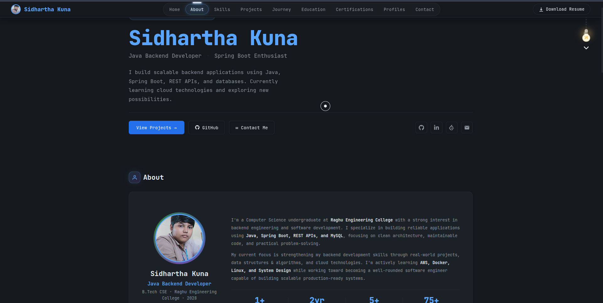

<div align="center">

# 🚀 Sidhartha Kuna

### Java Backend Developer • Spring Boot Enthusiast

Building scalable backend applications using **Java**, **Spring Boot**, **REST APIs**, **PostgreSQL**, and modern software engineering practices.

<p align="center">

<a href="https://sidharthakuna.github.io/Portfolio/">

</a>

<a href="https://github.com/sidharthakuna">

</a>

<a href="https://linkedin.com/in/sidharthakuna">

</a>

</p>

<p align="center">


</p>

</div>

---

# 🌐 Live Portfolio

### https://sidharthakuna.github.io/Portfolio/

---

# 📸 Portfolio Preview

<p align="center">
<a href="https://sidharthakuna.github.io/Portfolio/">

</a>
</p>

<p align="center">
<b>Click the image above to visit the live portfolio.</b>
</p>

---

# 👋 About This Repository

This repository contains the complete source code for my personal developer portfolio built with **React** and **Vite**.

The portfolio showcases:

- 👨‍💻 About Me
- 💻 Technical Skills
- 🚀 Featured Projects
- 📈 Learning Journey
- 🎓 Education
- 🏆 Certifications
- 📊 Coding Profiles
- 📬 Contact Information

---

# 👨‍💻 About Me

Hi! I'm **Sidhartha Kuna**, a Computer Science undergraduate from **Raghu Engineering College** passionate about backend engineering and software development.

I enjoy building scalable backend applications using Java, Spring Boot, REST APIs, PostgreSQL, and Docker while continuously improving my knowledge of Data Structures & Algorithms and System Design.

### 🌱 Currently Learning

- Spring Boot Advanced
- PostgreSQL
- Docker
- AWS
- Linux
- System Design
- Microservices

---

# 🎯 Current Status

| Information | Details |
|-------------|---------|
| 🎓 Degree | B.Tech Computer Science & Engineering |
| 🏫 College | Raghu Engineering College |
| 📍 Location | Andhra Pradesh, India |
| 📈 CGPA | 8.8 / 10 |
| 💼 Role | Java Backend Developer |
| 🚀 Looking For | Internship Opportunities |

---

# 🛠 Tech Stack

## Programming Languages

- Java
- JavaScript
- HTML5
- CSS3

## Backend

- Spring Boot
- Spring MVC
- REST APIs
- JWT Authentication
- Maven

## Frontend

- React
- Vite

## Database

- PostgreSQL
- MySQL

## Tools

- Git
- GitHub
- Docker
- Postman
- IntelliJ IDEA
- VS Code

---

# 📊 Skills

| Category | Technologies |
|----------|--------------|
| Programming | Java, JavaScript |
| Backend | Spring Boot, REST APIs, JWT |
| Database | PostgreSQL, MySQL |
| Frontend | React, HTML5, CSS3 |
| Tools | Git, Docker, Maven, Postman |
| Core CS | OOP, Collections Framework, DSA |

---

# 🚀 Featured Projects

## 🔐 Anonymous User Authentication System

A secure authentication backend developed using:

- Java
- Spring Boot
- PostgreSQL
- JWT
- Docker

### Features

- JWT Authentication
- Refresh Tokens
- Role-Based Authorization
- Anonymous User Identity
- REST APIs
- Dockerized Backend

---

## 🎵 AI Background Noise Remover

An AI-powered application for removing background noise from uploaded audio files.

### Tech Stack

- Java
- Spring Boot
- Python
- Docker
- MySQL

### Features

- Audio Upload
- AI Noise Reduction
- File Processing
- REST API Integration
- Clean Audio Download

---

# 📈 Learning Roadmap

- ✅ Java
- ✅ Object-Oriented Programming
- ✅ Collections Framework
- ✅ Spring Boot
- ✅ REST APIs
- ✅ JWT Authentication
- ✅ PostgreSQL
- ✅ Docker
- 🔄 AWS
- 🔄 Linux
- 🔄 System Design
- 🔄 Microservices

---

# 📂 Portfolio Sections

```text
🏠 Home
👨 About
💻 Skills
🚀 Projects
📈 Journey
🎓 Education
🏆 Certifications
📊 Coding Profiles
📩 Contact
```

---

# ⚙️ Running Locally

Clone the repository

```bash
git clone https://github.com/sidharthakuna/Portfolio.git
```

Move into the project

```bash
cd Portfolio
```

Install dependencies

```bash
npm install
```

Run the development server

```bash
npm run dev
```

Build for production

```bash
npm run build
```

---

# 📁 Project Structure

```text
Portfolio/
├── public/
│   ├── favicon.svg
│   ├── Icon.png
│   ├── icons.svg
│   └── Sidhartha_Kuna_Resume.pdf
│
├── src/
│   ├── assets/
│   ├── components/
│   ├── Stylings/
│   ├── App.jsx
│   ├── App.css
│   ├── index.css
│   └── main.jsx
│
├── preview.png
├── README.md
├── package.json
├── package-lock.json
└── vite.config.js
```

---

# 🚀 Features

- Modern Dark UI
- Fully Responsive
- Smooth Animations
- Resume Download
- Coding Profiles
- Interactive Timeline
- Project Showcase
- Contact Form

---

# 🎯 Future Improvements

- Blog Section
- Backend Contact API
- Analytics Dashboard
- Dark / Light Theme
- Project Filtering
- Certificate Gallery
- Visitor Counter

---

# 📊 GitHub Stats

<p align="center">


</p>

---

# 📬 Connect With Me

📧 **Email**

**sidharthakuna@gmail.com**

🌐 **Portfolio**

https://sidharthakuna.github.io/Portfolio/

💻 **GitHub**

https://github.com/sidharthakuna

💼 **LinkedIn**

https://linkedin.com/in/sidharthakuna

📍 **Location**

Andhra Pradesh, India

---

# ⭐ Support

If you found this repository helpful or liked the portfolio, consider giving it a ⭐.

It motivates me to continue building better software and sharing my work.

---

<div align="center">

## ❤️ Thank You for Visiting

Built with **React • Vite • JavaScript**

Designed & Developed by **Sidhartha Kuna**

© 2026 Sidhartha Kuna

</div>
